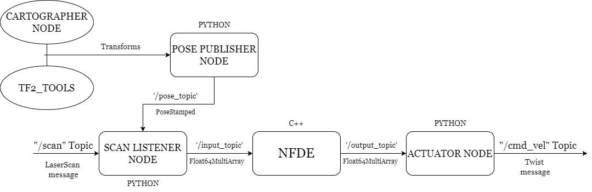

# NFDE : Neural Field Differential Equations
Practical ROS2 implementation of the project "Obstacle Avoidance using Neural Fields" made in the context of the course "Brain Inspired Computing" in the University of Liège. 

---

The structure of the project is the following one : 

The **NFDE** node is the efficient C++ node implementing the Neural Field Equations in a very generic way, while the other node are specific to the TurtleBot implementation. 
